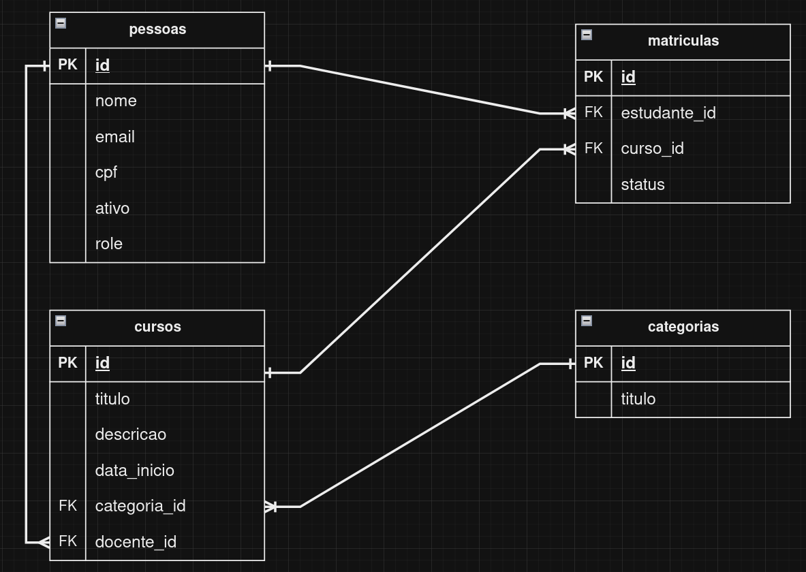

# Node.js and SQLite Web API for User and Tables Management

This API allows user registration and their association with different scenarios. It utilizes Node.js, Express, and SQLite to provide robust functionalities.

## Data Model




# How to Use

1. **Install project dependencies:**
   ```bash
   npm install

2. **Start to Server:**
```node server.js```

3. Access the API at http://localhost:3000

# Available Routes

- `POST /people`: Create a new user.
- `GET /people/:id`: Get details of a specific user.
- `POST /course`: Create a new course.
- `GET /course/:id`: Get details of a specific course.
# Exemplo de Requisição para Criar um Novo Usuário

```json
{
  "name": "User Name",
  "email": "user@email.com",
  "password": "password123"
}


